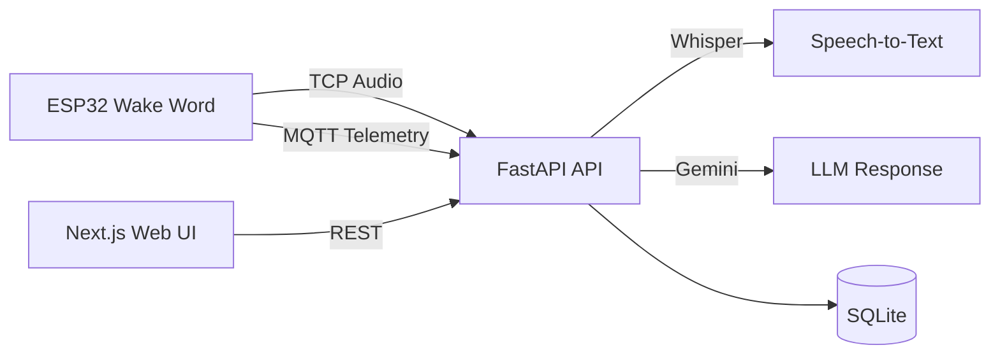
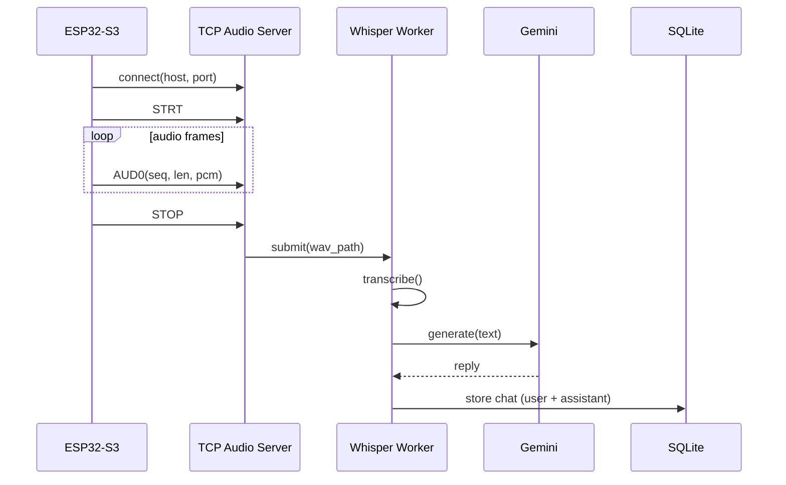
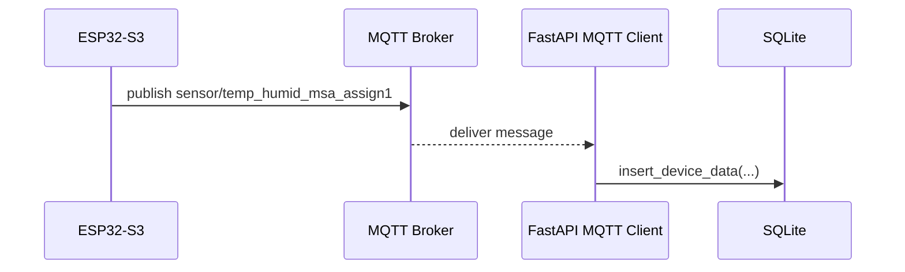
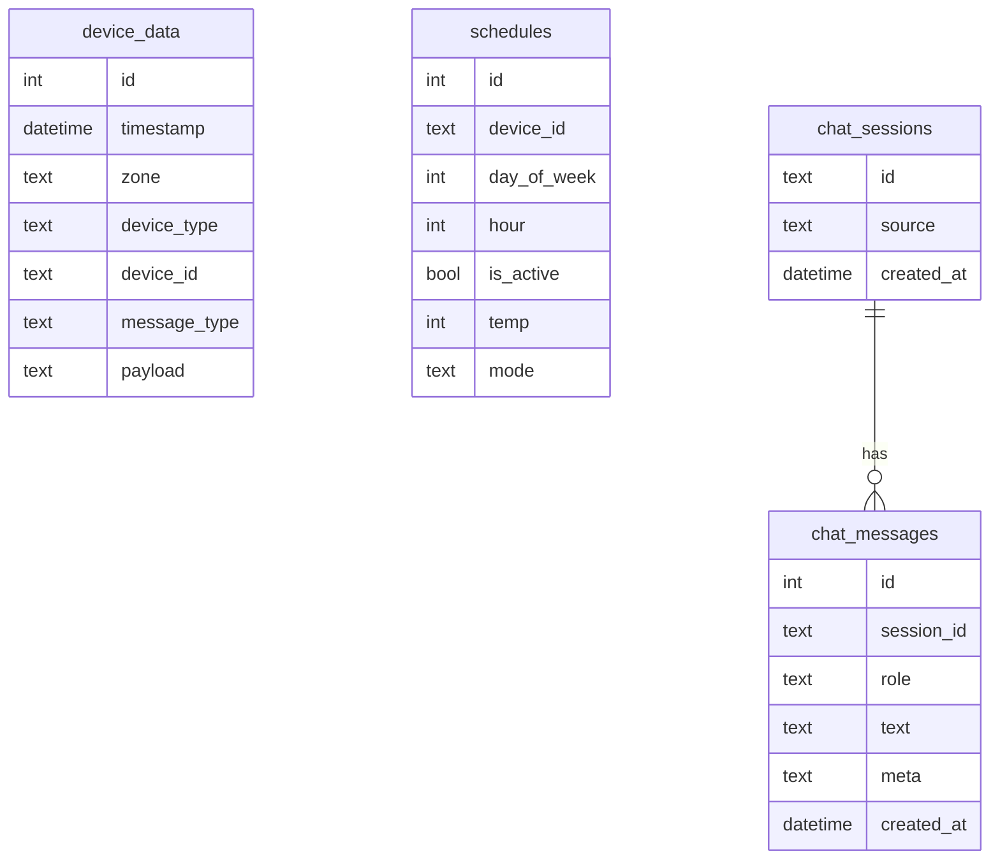
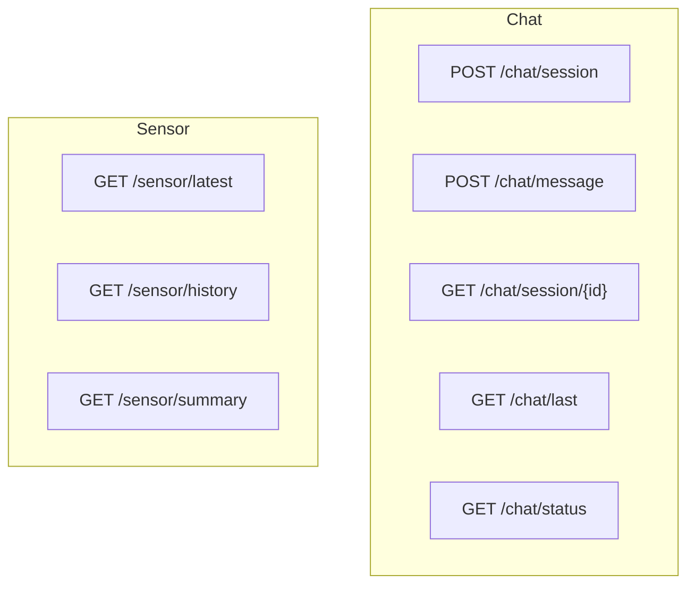
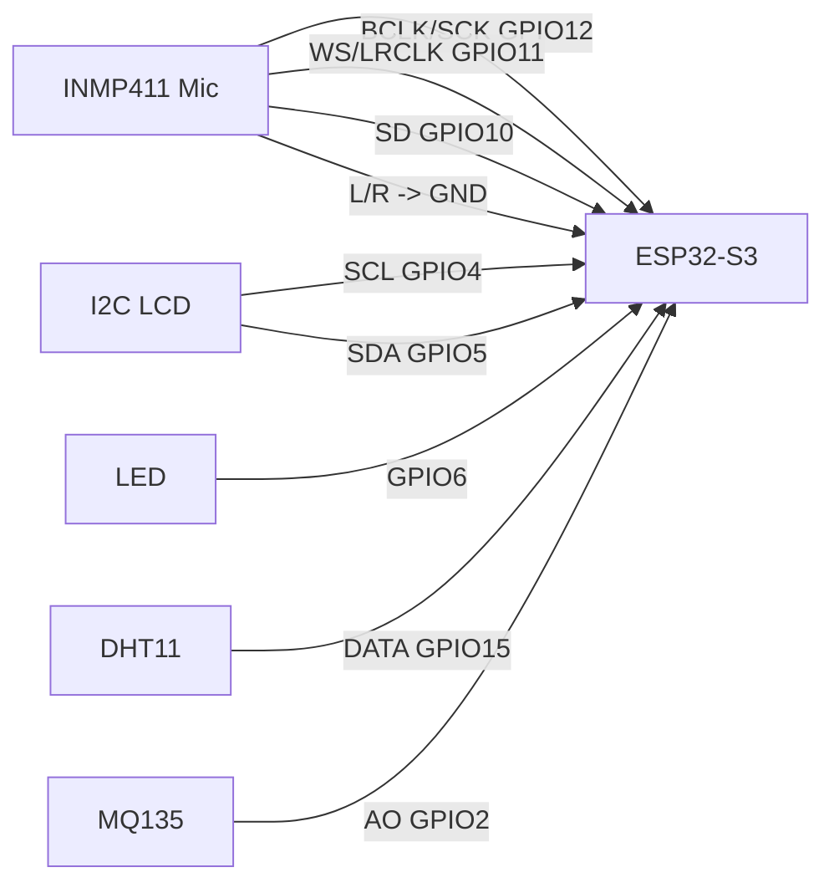

# Sơ đồ hệ thống (Mermaid)

## Tổng quan hệ thống

```mermaid
flowchart LR
  ESP32[ESP32 Wake Word] -->|TCP Audio| API[FastAPI API]
  API -->|Whisper| STT[Speech-to-Text]
  API -->|Gemini| LLM[LLM Response]
  API --> DB[(SQLite)]
  WEB[Next.js Web UI] -->|REST| API
  ESP32 -->|MQTT Telemetry| API
```

## Luồng Audio TCP

```mermaid
sequenceDiagram
  participant ESP as ESP32-S3
  participant TCP as TCP Audio Server
  participant WH as Whisper Worker
  participant GM as Gemini
  participant DB as SQLite

  ESP->>TCP: connect(host, port)
  ESP->>TCP: STRT
  loop audio frames
    ESP->>TCP: AUD0(seq, len, pcm)
  end
  ESP->>TCP: STOP
  TCP->>WH: submit(wav_path)
  WH->>WH: transcribe()
  WH->>GM: generate(text)
  GM-->>WH: reply
  WH->>DB: store chat (user + assistant)
```

## MQTT Telemetry

```mermaid
sequenceDiagram
  participant ESP as ESP32-S3
  participant BR as MQTT Broker
  participant API as FastAPI MQTT Client
  participant DB as SQLite

  ESP->>BR: publish sensor/temp_humid_msa_assign1
  BR-->>API: deliver message
  API->>DB: insert_device_data(...)
```

## Database (Logical)

```mermaid
erDiagram
  device_data {
    int id
    datetime timestamp
    text zone
    text device_type
    text device_id
    text message_type
    text payload
  }

  schedules {
    int id
    text device_id
    int day_of_week
    int hour
    bool is_active
    int temp
    text mode
  }

  chat_sessions {
    text id
    text source
    datetime created_at
  }

  chat_messages {
    int id
    text session_id
    text role
    text text
    text meta
    datetime created_at
  }

  chat_sessions ||--o{ chat_messages : has
```

## API Endpoints

```mermaid
flowchart TB
  subgraph Chat
    CS[POST /chat/session]
    GM[POST /chat/message]
    CH["GET /chat/session/{id}"]
    CL[GET /chat/last]
    ST[GET /chat/status]
  end

  subgraph Sensor
    SL[GET /sensor/latest]
    SH[GET /sensor/history]
    SS[GET /sensor/summary]
  end
```

## Đối Dây (ESP32-S3)

```mermaid
flowchart LR
  ESP[ESP32-S3]

  MIC[INMP411 Mic]
  LCD[I2C LCD]
  LED[LED]
  DHT[DHT11]
  MQ[MQ135]

  MIC -- BCLK/SCK GPIO12 --> ESP
  MIC -- WS/LRCLK GPIO11 --> ESP
  MIC -- SD GPIO10 --> ESP
  MIC -- L/R -> GND --> ESP

  LCD -- SCL GPIO4 --> ESP
  LCD -- SDA GPIO5 --> ESP

  LED -- GPIO6 --> ESP
  DHT -- DATA GPIO15 --> ESP
  MQ -- AO GPIO2 --> ESP
```
