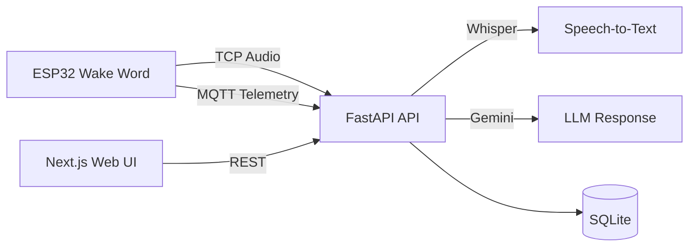
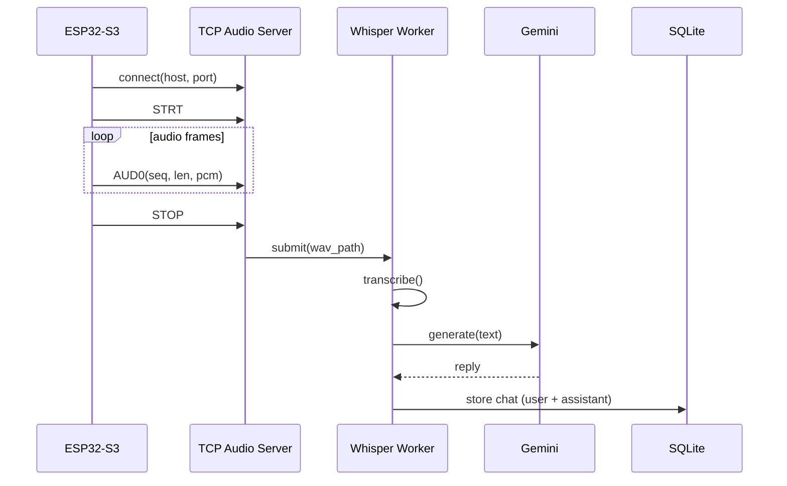
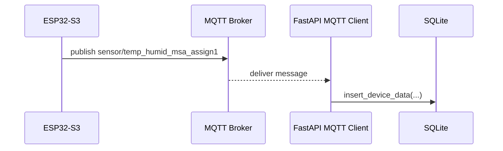
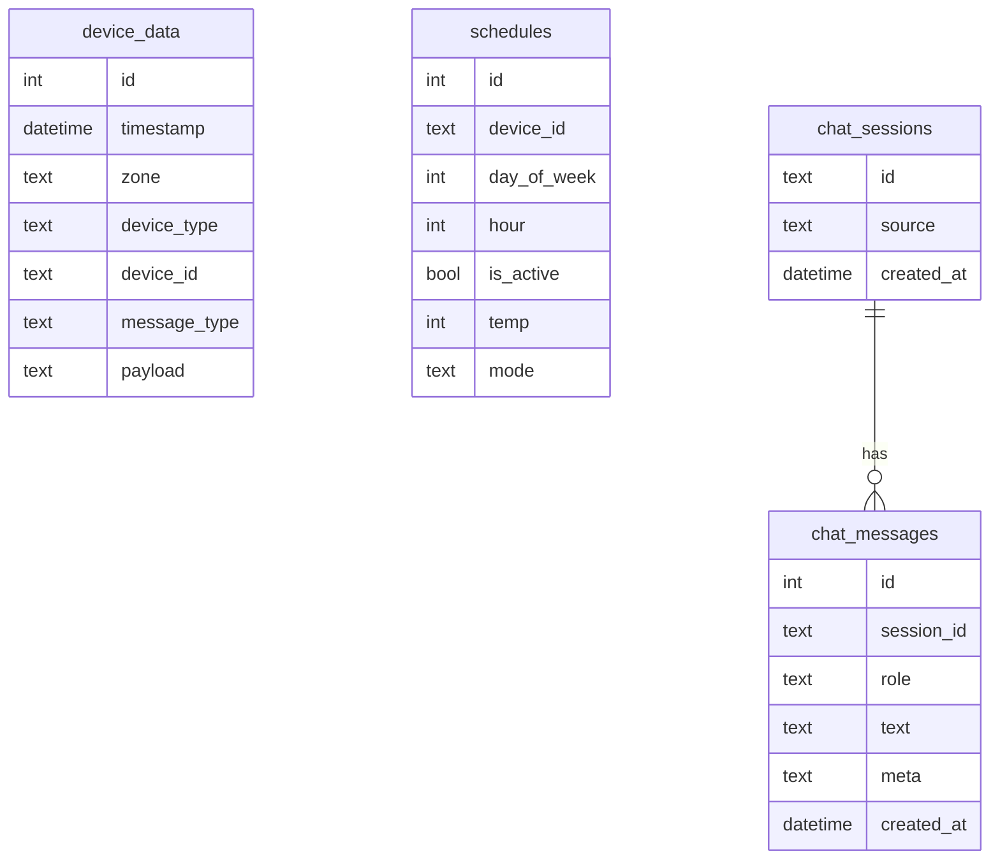
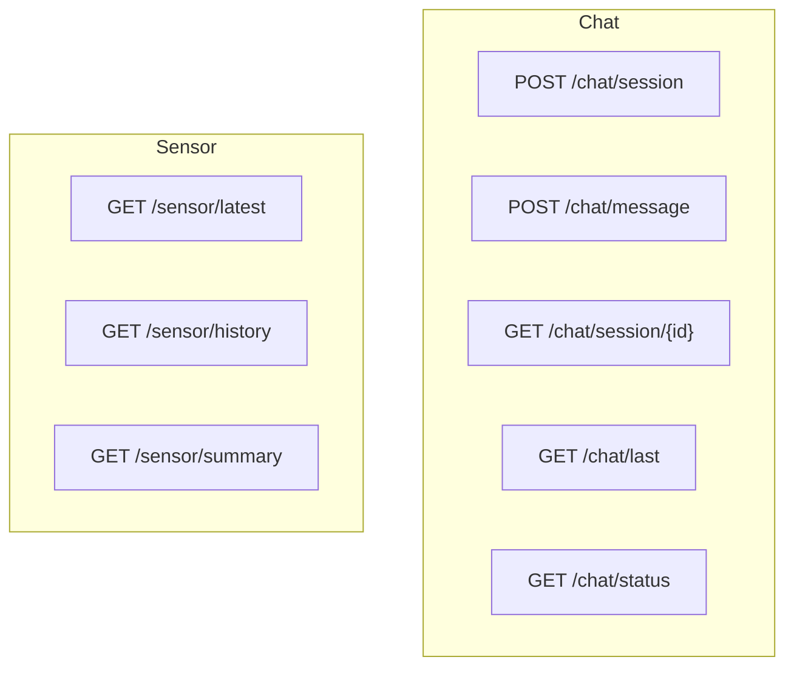
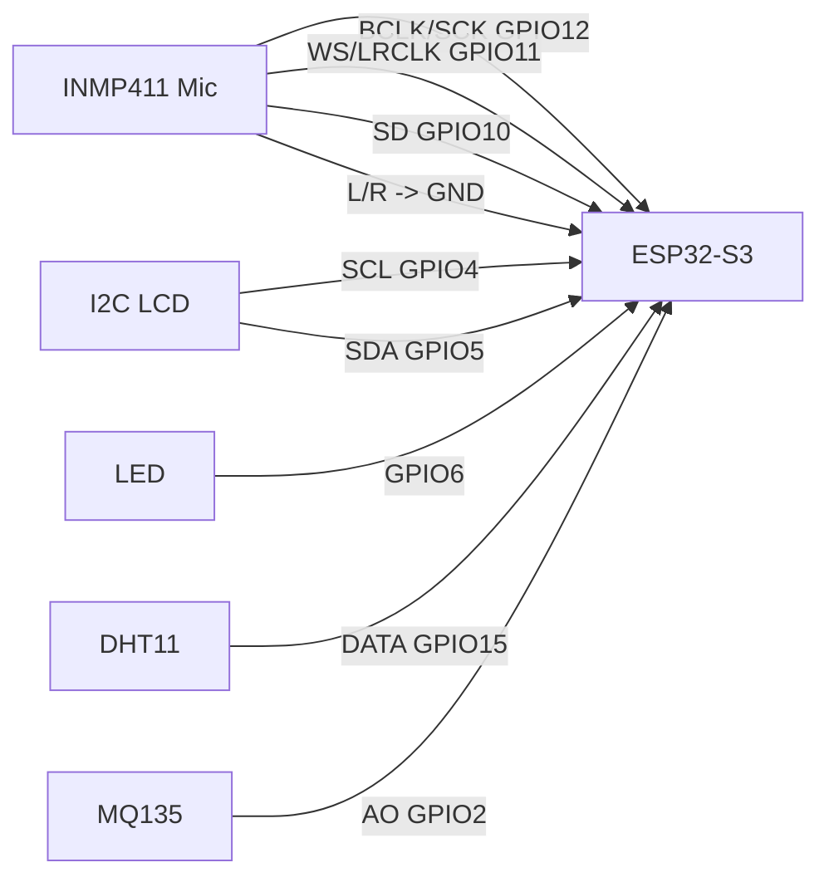

# Smart Home Voice Assistant

Hệ thống Smart Home điều khiển bằng giọng nói, kết nối ESP32 (wake-word) với FastAPI (Whisper + Gemini) và UI web mobile-first để hiển thị hội thoại và dữ liệu cảm biến.

## Mục lục
- Tổng quan
- Tính năng
- Kiến trúc nhanh
- Sơ đồ hệ thống (Mermaid)
- Tech stack
- Bắt đầu nhanh
- Cấu trúc repo
- Cấu hình môi trường
- Chạy hệ thống
- API chính
- MQTT (tùy chọn)
- Database
- Tài liệu liên quan
- Kiểm thử
- CI/CD
- Đóng góp
- License

## Tổng quan
Luồng chính:
1. ESP32 nhận wake word "Hi, Jason".
2. ESP32 stream audio TCP đến API.
3. API lưu WAV, transcribe bằng Whisper, gửi text sang Gemini.
4. Kết quả hội thoại lưu vào SQLite.
5. Web UI hiển thị chat và telemetry.

## Tính năng
- Wake-word trên ESP32 (ESP-SR).
- Streaming audio TCP từ thiết bị về API.
- Whisper chuyển giọng nói thành văn bản.
- Gemini tạo phản hồi hội thoại.
- Lưu chat và dữ liệu cảm biến vào SQLite.
- UI web mobile-first hiển thị chat và sensor.

## Kiến trúc nhanh
Audio/Wake-word:
```
ESP32 WakeNet/VAD -> TCP audio -> FastAPI recorder -> WAV
-> Whisper -> Gemini -> SQLite (chat_messages)
```

MQTT Telemetry:
```
ESP32 MQTT publish -> FastAPI MQTT subscribe -> SQLite (device_data)
```

Web UI:
```
Next.js UI -> FastAPI REST (/chat/*, /sensor/*)
```

## Sơ đồ hệ thống (Mermaid)


### Sơ đồ Luồng Audio TCP


### Sơ đồ MQTT Telemetry


### Sơ đồ Database (Logical)


### Sơ đồ API Endpoints


### Sơ đồ Đối Dây (ESP32-S3)


## Tech stack
- Frontend: Next.js 14, React, TailwindCSS
- Backend: FastAPI, Python, SQLite, Whisper, Gemini API
- IoT: ESP32-S3 (ESP-IDF / PlatformIO), INMP411 mic, LCD (optional)
- Giao tiếp: TCP (audio), MQTT (telemetry, optional)

## Bắt đầu nhanh
### Yêu cầu
- Node.js v18+
- Python 3.10+
- pnpm (`npm install -g pnpm`)

### Cài dependencies
```bash
pnpm install
```

### Backend (Python)
```bash
cd apps/api
python -m venv venv
.\venv\Scripts\activate
pip install -r requirements.txt
```

### Cài Whisper (tùy chọn)
```bash
pip install -U openai-whisper torch
```

## Cấu trúc repo
```
/
|-- apps/
|   |-- api/           # FastAPI backend
|   |-- iot/           # ESP32-S3 firmware
|   |-- web/           # Next.js UI
|-- packages/
|   |-- db/            # SQLite db + schema.sql
|   |-- ui/            # Shared UI
|   |-- api-client/    # Reserved
|   |-- tsconfig/
|   |-- eslint-config/
|-- turbo.json
|-- pnpm-workspace.yaml
|-- package.json
```

## Cấu hình môi trường
Tạo hoặc cập nhật file `apps/api/.env`:
```
GEMINI_API_KEY=your_key
GEMINI_MODEL=gemini-2.5-flash
WHISPER_ENABLED=1
WHISPER_MODEL=base
WHISPER_LANGUAGE=
WHISPER_TASK=transcribe
AUDIO_TCP_ENABLED=1
AUDIO_TCP_HOST=0.0.0.0
AUDIO_TCP_PORT=3334
CHAT_DEVICE_SESSION_ID=device
CHAT_DEFAULT_SESSION_ID=device
MQTT_BROKER_URL=mqtt://localhost:1883
MQTT_SUB_TOPICS=sensor/temp_humid_msa_assign1,smart-home/+/+/+/+
```

## Chạy hệ thống
### Chạy tất cả (Turbo)
```bash
pnpm dev
```

### Chạy từng phần
Backend:
```bash
cd apps/api
uvicorn main:app --reload --port 8000
```

Frontend:
```bash
cd apps/web
pnpm dev
```

IoT:
Build/flash trong `apps/iot` bằng PlatformIO. Cấu hình WiFi + audio host/port trong `sdkconfig` gồm `CONFIG_SMART_HOME_WIFI_SSID`, `CONFIG_SMART_HOME_WIFI_PASSWORD`, `CONFIG_SMART_HOME_AUDIO_UDP_HOST`, `CONFIG_SMART_HOME_AUDIO_UDP_PORT`.

## API chính
Chat:
- `POST /chat/session`
- `POST /chat/message`
- `GET /chat/session/{id}`
- `GET /chat/last`
- `GET /chat/status`

Sensors:
- `GET /sensor/latest`
- `GET /sensor/history`
- `GET /sensor/summary`

## MQTT (tùy chọn)
Broker: `MQTT_BROKER_URL` (API), `SMART_HOME_MQTT_BROKER_URI` (ESP32). Auth: `MQTT_USERNAME` / `MQTT_PASSWORD` và `SMART_HOME_MQTT_USERNAME` / `SMART_HOME_MQTT_PASSWORD` (nếu dùng). Topics mặc định: telemetry `sensor/temp_humid_msa_assign1` và wildcard `smart-home/+/+/+/+`.

Chi tiết schema MQTT: xem mục MQTT Schema bên dưới.

## Database
SQLite nằm ở `packages/db/smarthome.db`, tự khởi tạo khi API chạy.

Bảng chính:
- `device_data`: telemetry (MQTT)
- `chat_sessions`, `chat_messages`: hội thoại
- `schedules`: lịch tự động hóa (dự phòng)

## Tài liệu liên quan
- `ARCHITECTURE.md`

## Kiểm thử
Chưa có bộ test tự động được cấu hình. Nếu cần, có thể bổ sung test cho:
- API (FastAPI)
- UI (Next.js)
- Firmware (ESP32)

## CI/CD
Chưa cấu hình pipeline CI/CD.

## Đóng góp
1. Fork repo và tạo branch mới.
2. Ghi rõ mục tiêu thay đổi.
3. Tạo PR với mô tả ngắn gọn.

## License
Chưa xác định.

## Wake Word (ESP32)
Tài liệu này tổng hợp **toàn bộ bước liên quan đến Wake Word** trong dự án ESP32-S3 (ESP-SR + INMP411), bao gồm luồng **TCP audio** về API server.

## 1) Chuẩn bị phần cứng
- Mic INMP411, nguồn 3.3V, GND chung.
- Dây I2S theo cấu hình bạn đang dùng trong code.
  - Ví dụ hiện tại trong `apps/iot/main/smart_home_mqtt/smart_home_mqtt.cpp`:
    - `BCLK/SCK` -> GPIO12
    - `WS` -> GPIO11
    - `SD` -> GPIO10
    - `LR` -> GND (mono)
- (Tuỳ chọn) LCD I2C để hiển thị trạng thái:
  - `SCL` -> GPIO4
  - `SDA` -> GPIO5
- (Tuỳ chọn) LED trạng thái record:
  - `LED` -> GPIO6 (bật khi bắt đầu record, tắt khi dừng)
- (Tuỳ chọn) Sensor:
  - `DHT11 DATA` -> GPIO15 (khuyến nghị tránh GPIO1 vì UART TX)
  - `MQ-135 A0` -> GPIO2 (ADC1_CH1)

## 2) Chọn Wake Word + VAD trong menuconfig
Chạy:
```bash
cd apps/iot
pio run -t menuconfig
```
Chọn:
- `ESP Speech Recognition -> Load Multiple Wake Words (WakeNet9)`
  - Bật câu bạn muốn, ví dụ **Hi, Jason** (`wn9_hijason_tts2`)
- `ESP Speech Recognition -> Select voice activity detection`
  - Chọn **vadnet1 medium**

Lưu cấu hình rồi thoát.

## 3) Build để tạo cấu hình
```bash
pio run
```

## 4) Đảm bảo sdkconfig đúng
Nếu `.pio/build/.../config/sdkconfig.h` không tồn tại, script `gen_models.bat` sẽ dùng `apps/iot/sdkconfig`.
Kiểm tra nhanh:
```powershell
Select-String -Path ".pio\build\esp32-s3-devkitc-1-idf\config\sdkconfig.h","sdkconfig" -Pattern "CONFIG_SR_WN_|CONFIG_SR_VADN"
```
Bạn phải thấy:
- WakeNet đã bật (vd `CONFIG_SR_WN_WN9_HIJASON_TTS2=y`)
- VADNET1 medium (`CONFIG_SR_VADN_VADNET1_MEDIUM=y`)

## 5) Tạo srmodels.bin
```bat
gen_models.bat
```
Kết quả nằm ở `apps/iot/srmodels/srmodels.bin`.

## 6) Kiểm tra srmodels có đúng model (tuỳ chọn)
Windows PowerShell:
```powershell
%USERPROFILE%\.platformio\penv\.espidf-5.5.0\Scripts\python.exe check_models.py
```
Kỳ vọng có `wn9_hijason_tts2` và `vadnet1_medium`.

## 7) Lấy offset partition model
```bat
%USERPROFILE%\.platformio\penv\.espidf-5.5.0\Scripts\python.exe ^
  %USERPROFILE%\.platformio\packages\framework-espidf\components\partition_table\gen_esp32part.py ^
  .pio\build\esp32-s3-devkitc-1-idf\partitions.bin
```
Tìm dòng `model` để lấy **Offset**.
Bạn cũng có thể lấy từ boot log, ví dụ: `model  ...  005f0000` -> offset là `0x005f0000`.

## 8) Flash srmodels.bin
```bat
%USERPROFILE%\.platformio\penv\.espidf-5.5.0\Scripts\python.exe ^
  %USERPROFILE%\.platformio\packages\tool-esptoolpy\esptool.py ^
  --chip esp32s3 --port COMx write_flash 0xOFFSET srmodels\srmodels.bin
```
Nếu gặp lỗi `ModuleNotFoundError: No module named 'serial'`, cài pyserial:
```bat
%USERPROFILE%\.platformio\penv\.espidf-5.5.0\Scripts\python.exe -m pip install pyserial
```

## 9) Flash firmware
```bash
pio run -t upload --upload-port COMx
```

## 10) Monitor và test
```bash
pio device monitor -b 115200 --port COMx
```
Bạn nên thấy:
- `MODEL_LOADER: Successfully load srmodels`
- **Không còn** `wakenet model not found`
- Khi nói câu đã chọn (ví dụ “Hi, Jason”) => log `Wake word detected!`
- Nếu có LCD I2C: hiện `WAKE WORD / DETECTED` trong ~2s rồi về `SMART HOME / LISTENING...`

## 11) Kết nối TCP audio tới API
- Trên API server, đảm bảo `AUDIO_TCP_ENABLED=1` và lắng nghe port `AUDIO_TCP_PORT` (mặc định 3334).
- Trên ESP32, cấu hình:
  - `CONFIG_SMART_HOME_AUDIO_UDP_HOST` = IP máy chạy API
  - `CONFIG_SMART_HOME_AUDIO_UDP_PORT` = 3334 (TCP port)

Lưu ý: biến config còn chữ "UDP" nhưng luồng hiện tại dùng **TCP**.

## 12) MQTT (tuỳ chọn)
Nếu bạn muốn dùng MQTT (telemetry/trigger), làm nhanh như sau:

1. Khởi động broker (ví dụ Mosquitto):
```bash
mosquitto_sub -h 127.0.0.1 -p 1883 -t "#" -v
```

2. Cấu hình API trong `apps/api/.env`:
```
MQTT_BROKER_URL=mqtt://<IP_MAY_CHAY_BROKER>:1883
MQTT_USERNAME=
MQTT_PASSWORD=
MQTT_SUB_TOPICS=sensor/temp_humid_msa_assign1,smart-home/+/+/+/+
```

3. Cấu hình ESP32 (nếu cần) trong sdkconfig:
- `CONFIG_SMART_HOME_MQTT_BROKER_URI`
- `CONFIG_SMART_HOME_MQTT_USERNAME`
- `CONFIG_SMART_HOME_MQTT_PASSWORD`

4. Nếu chạy Mosquitto trong WSL2:
- Đảm bảo broker listen `0.0.0.0:1883`.
- Thêm portproxy từ Windows -> WSL IP:
```powershell
netsh interface portproxy add v4tov4 listenaddress=0.0.0.0 listenport=1883 connectaddress=<WSL_IP> connectport=1883
```
- ESP32 dùng URI: `mqtt://<WINDOWS_LAN_IP>:1883`.

## 12b) Sensor data -> DB (tuỳ chọn)
- ESP32 publish JSON vào topic `sensor/temp_humid_msa_assign1`.
- API sẽ lưu DB và cung cấp endpoint:
  - `GET /sensor/latest`
  - `GET /sensor/history?limit=100`
  - `GET /sensor/summary?hours=24`

## 13) Lỗi thường gặp
- **`wakenet model not found`**: srmodels.bin không chứa WakeNet hoặc flash sai offset.
- **AFE pipeline vẫn WebRTC**: VADNET1 chưa bật trong sdkconfig đang dùng.
- **Không có `.pio/build/.../config/sdkconfig.h`**: chạy `pio run` để tạo config, hoặc `gen_models.bat` sẽ dùng `apps/iot/sdkconfig`.
- **`ModuleNotFoundError: No module named 'serial'`**: cài pyserial theo bước 8.
- **`TCP send failed`**: API server không chạy, sai IP/port, hoặc kết nối bị ngắt.
- **`temperature/humidity = null`**: thường do DHT11 lỗi hoặc pin không phù hợp. Ưu tiên GPIO15 + pull-up 4.7k–10k.

## 14) Ghi nhớ
- Mỗi lần đổi wake word / VAD: **build -> gen_models.bat -> flash srmodels.bin**.
- Nếu tăng size model: phải chỉnh `apps/iot/partitions.csv` rồi build lại.

## MQTT Schema
This document outlines the standard MQTT topic structure for the **IoT Smart AC System**.

**Root Topic**: `smart-home`

## 1. Telemetry (Sensors -> Cloud)
Data sent periodically by devices (e.g., every 5 seconds).

**Topic**: `smart-home/{zone}/{device_type}/{device_id}/telemetry`

**Example**: `smart-home/living-room/sensor/env-01/telemetry`

**Payload (JSON)**:
```json
{
  "timestamp": 1706428000,
  "temperature": 24.5,
  "humidity": 60.2,
  "power_consumption": 1.2
}
```

## 2. Status / Heartbeat (Device <-> Cloud)
Used to track device connectivity (LWT - Last Will and Testament) and health.

**Topic**: `smart-home/{zone}/{device_type}/{device_id}/status`

**Example**: `smart-home/living-room/ac/daikin-x/status`

**Payload**:
- **Online**: `{"state": "online", "ip": "192.168.1.105", "uptime": 1200}`
- **Offline**: `{"state": "offline"}` (Sent via LWT)

## 3. Command (Cloud -> Device)
Instructions sent to the device to change its state.

**Topic**: `smart-home/{zone}/{device_type}/{device_id}/command`

**Example**: `smart-home/living-room/ac/daikin-x/command`

**Payload (JSON)**:
```json
{
  "request_id": "req-001",
  "method": "set_state",
  "params": {
    "power": "ON",
    "mode": "cool",
    "target_temp": 22,
    "fan_speed": 2
  }
}
```

## 4. Command Response (Device -> Cloud)
Confirmation that a command was received and executed.

**Topic**: `smart-home/{zone}/{device_type}/{device_id}/response`

**Example**: `smart-home/living-room/ac/daikin-x/response`

**Payload (JSON)**:
```json
{
  "request_id": "req-001",
  "success": true,
  "current_state": {
    "power": "ON",
    "target_temp": 22
  }
}
```
